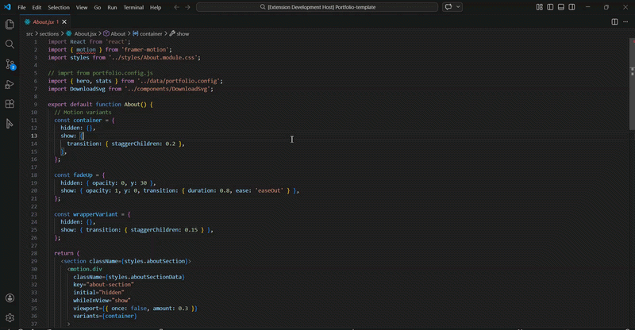
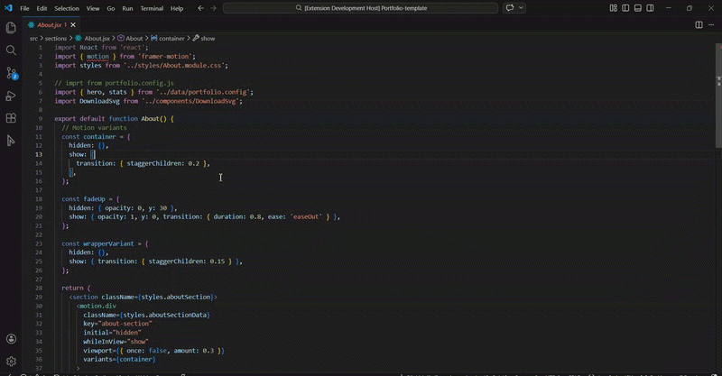
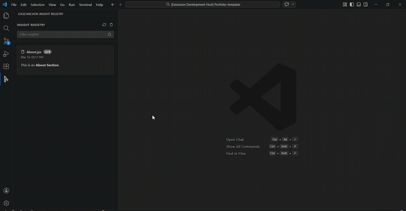

# LogicAnchor

### The Persistent Context Layer for Complex Codebases

<p align="left">
  <a href="./LICENSE">
    
  </a>
  
  
  
  <a href="https://github.com/byllzz">
    
  </a>
  <a href="https://github.com/byllzz/logicAnchor-vscode/releases">
    
  </a>
</p>

<p align="center">
Pin the <b>“Why”</b> behind your code directly inside your editor.
</p>

---
Instead of cluttering your files with massive comment blocks, LogicAnchor introduces a **structured documentation layer** that lives exactly where your logic does.
By anchoring insights, design decisions, and logic explanations to **specific lines of code**, you ensure that the **“Why” behind your implementation is never lost over time**.

---
## Features

- Save thoughts or explanations directly to a specific line using the **context menu**.
- Anchors appear in the **editor gutter**, making it easy to see where deeper insights exist in the code.
- Hover over any anchored line to instantly view the insight rendered as **Markdown**.
- Browse, search, and manage all saved insights from a dedicated **sidebar registry panel**.
- Clicking an insight automatically **opens the file and jumps to the exact anchored line**.
- **Smart Highlight:** Temporarily highlight the line with a subtle glow, guiding your eyes exactly to the relevant code.
- The UI automatically adapts to your **VS Code theme** (Dark, Light, and High Contrast).
- Write rich explanations using **full Markdown support**, including code blocks, lists, and formatting.

---

##  Usage

### 1. Instant Context Anchoring
**Right-click any line** or press `Ctrl + Alt + A` to attach architectural decisions.


---

### 2. One-Click Access
Launch the **LogicAnchor Insight Registry** directly from the Activity Bar.



---

### 3. Centralized Registry
Access every architectural decision across your entire workspace.


---

##  Insight Registry

A dedicated **sidebar panel** lets you:

* Search all insights
* Browse architectural decisions
* Manage project documentation

---

## 🔗 Deep Linking

Click any insight in the registry to **jump instantly to the file and line where it was created**.

---

##  Theme Adaptive

LogicAnchor automatically adapts to your **VS Code theme**:

* Dark Mode
* Light Mode
* High Contrast

---


### View Insights

Click the **Anchor Icon** in the **Activity Bar** to open the **Insight Registry**.

From there you can:

*  Search insights
*  Navigate code context
*  Delete outdated notes

---

#  Optional Keyboard Shortcut

You can add a shortcut for faster anchoring inside `keybindings.json`.

```json
{
  "key": "ctrl+alt+a",
  "command": "logicanchor.addNote"
}
```

---

#  Configuration

LogicAnchor is fully configurable using **VS Code settings**.

---

## Toggle Gutter Icons

```json
{
  "logicanchor.showGutterIcon": true
}
```

---

## Enable Markdown Rendering

```json
{
  "logicanchor.enableMarkdown": true
}
```

---

## Exclude Files

```json
{
  "logicanchor.excludedFiles": [
    "**/node_modules/**",
    "**/.git/**",
    "*.log"
  ]
}
```

---

#  Installation

### From VS Code Marketplace

1. Open **VS Code**
2. Go to **Extensions** (`Ctrl + Shift + X`)
3. Search for **LogicAnchor**
4. Click **Install**

---

#  Change Log

See the **CHANGELOG.md** file for version history and updates.

---

#  Issues

If you find a bug or have a suggestion for a **new feature**, please open an **Issue** in the repository.

---

# Contributing

Contributions are welcome.

1. Fork the repository
2. Create a new branch
3. Submit a **Pull Request**

---

#  License

Distributed under the **MIT License**.

See `LICENSE` for more information.

---
---

*Created by [Bilal Malik (byllzz)](https://github.com/byllzz)*

<p align="center">
Built for developers who refuse to lose context.
</p>
